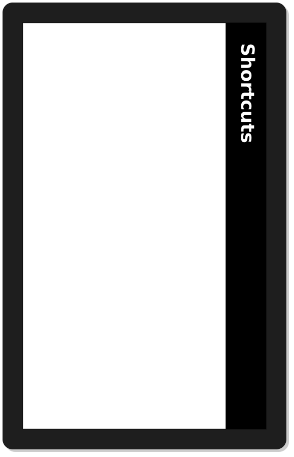
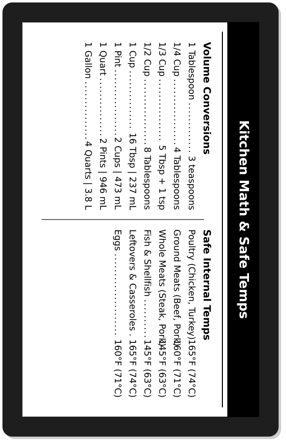
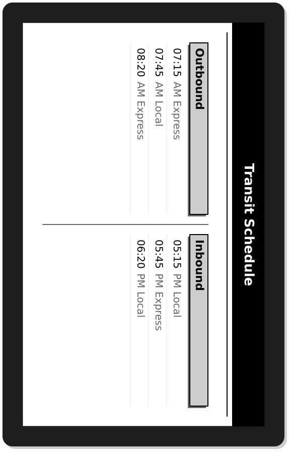

# Card Examples Gallery

Every card shown below was generated by CrossPoint Deck and displayed here as a PNG with a simulated device frame. On your XTEink X4 they appear as crisp monochrome BMPs.

Click any image to see it full-size.

---

## Identity & Access

| Card Preview | Details & Command |
| :---: | :--- |
|  | **Owner Card**<br/>Show "this e-reader belongs to" info.<br/><br/>```bash<br/>./deck owner --name "Your Name" --email "you@example.com" --output ./output/owner.bmp<br/>``` |
|  | **WiFi Access**<br/>QR code that guests can scan. No typing passwords.<br/><br/>```bash<br/>./deck wifi --ssid "YourNetwork" --password "secret123" --output ./output/wifi.bmp<br/>``` |
|  | **Business Card**<br/>Contact info with a vCard QR code.<br/><br/>```bash<br/>./deck business --name "Alex Reader" --title "Developer" --phone "+1-555-0100" --output ./output/business.bmp<br/>``` |

---

## Reference & Cheat Sheets

| Card Preview | Details & Command |
| :---: | :--- |
|  | **Keyboard Shortcuts (Redesigned)**<br/>Put the shortcuts you actually use on your desk. Grouped by category with a 3-column layout.<br/><br/>```bash<br/>./deck cheatsheet --shortcuts "Navigation|j:Down,k:Up,h:Left,l:Right;Editing|i:Insert,a:Append,:w:Save,:q:Quit;Search|/:Search forward,?:Search backward,n:Next" --output output/cheatsheet.bmp<br/>``` |
|  | **NATO Phonetic Alphabet**<br/>Classic laminated reference.<br/><br/>```bash<br/>./deck nato --output ./output/nato.bmp<br/>``` |

---

## Productivity & Planning

| Card Preview | Details & Command |
| :---: | :--- |
|  | **Year-at-a-Glance Calendar**<br/>Replaces a wall calendar.<br/><br/>```bash<br/>./deck calendar --year 2026 --output ./output/calendar.bmp<br/>``` |

---

## Home, Travel & Kitchen

| Card Preview | Details & Command |
| :---: | :--- |
|  | **Kitchen Math & Safe Temps (New)**<br/>Conversions and safe internal temperatures. Perfect for the kitchen counter.<br/><br/>```bash<br/>./deck kitchen-math --output output/kitchen-math.bmp<br/>``` |
|  | **Commute Schedule (New)**<br/>Your daily train or bus times at a glance.<br/><br/>```bash<br/>./deck transit --outbound "07:15 AM Express,07:45 AM Local,08:20 AM Express" --inbound "05:15 PM Local,05:45 PM Express,06:20 PM Local" --output output/transit.bmp<br/>``` |
|  | **Recipe Card**<br/>One recipe, big type. No scrolling with flour on your fingers.<br/><br/>```bash<br/>./deck recipe --title "Pasta Carbonara" --ingredients "Spaghetti,Eggs,Pancetta,Parmesan" --steps "Cook pasta,Fry pancetta,Mix eggs & cheese,Combine all,Serve hot" --time "20 min" --output ./output/carbonara.bmp<br/>``` |

---

## More Card Types

CrossPoint Deck supports 27 card types total. Run `./deck --help` to see them all.

| Card | Example Command |
|---|---|
| `coffee` | `./deck coffee --method "French Press" --ratio "1:15" --temp "94°C" --time "4 min" --output ./output/coffee.bmp` |
| `convert` | `./deck convert --output ./output/convert.bmp` |
| `emergency` | `./deck emergency --country "USA" --contacts "Police:911" --blood "O+" --output ./output/emergency.bmp` |
| `library` | `./deck library --name "Alex" --card-number "29103000123456" --branch "Downtown" --output ./output/library.bmp` |
| `loyalty` | `./deck loyalty --stores "Airline:FF123456,Gym:MEM789" --output ./output/loyalty.bmp` |
| `maintenance` | `./deck maintenance --output ./output/maintenance.bmp` |
| `meeting` | `./deck meeting --room "Boardroom" --output ./output/meeting.bmp` |
| `morse` | `./deck morse --output ./output/morse.bmp` |
| `periodic` | `./deck periodic --output ./output/periodic.bmp` |
| `plant` | `./deck plant --plant "Monstera" --water "Weekly" --output ./output/monstera.bmp` |
| `stretch` | `./deck stretch --output ./output/stretch.bmp` |
| `timezones` | `./deck timezones --local "New York EST" --cities "Tokyo:+14h" --output ./output/timezones.bmp` |
| `workout` | `./deck workout --title "Morning Circuit" --exercises "Push-ups:10,Squats:15" --rounds "3" --rest "60" --output ./output/workout.bmp` |

All cards support `--portrait` for 480×800 output and `--font /path/to/font.ttf` for custom fonts.

---

*Want to add a new card type? See [CONTRIBUTING.md](CONTRIBUTING.md).*
