# Card Examples Gallery

Every card shown below was generated by CrossPoint Deck and displayed here as a PNG. On your XTEink X4 they appear as crisp monochrome BMPs.

Click any image to see it full-size.

---

## Identity & Access

### Owner Card

Show "this e-reader belongs to" info with an optional phone number.

<p align="center">
  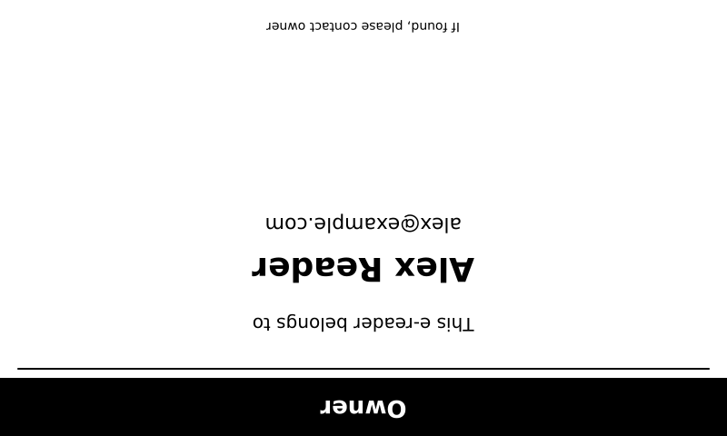
</p>

```bash
./deck owner --name "Your Name" --email "you@example.com" --output ./my-deck/owner.bmp
./deck owner --name "Your Name" --email "you@example.com" --phone "+1-555-0100" --output ./my-deck/owner.bmp
```

### WiFi Access Card

QR code that guests can scan. No typing passwords on tiny keyboards.

<p align="center">
  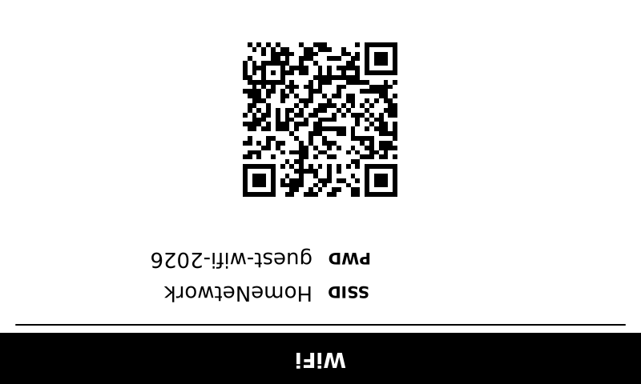
</p>

```bash
./deck wifi --ssid "YourNetwork" --password "secret123" --output ./my-deck/wifi.bmp
```

### Business Card

Contact info with a vCard QR code. Scan it to add the contact directly to a phone.

<p align="center">
  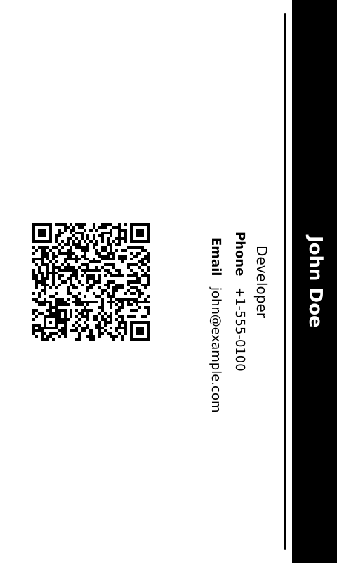
</p>

```bash
./deck business --name "Alex Reader" --title "Developer" --email "alex@example.com" --phone "+1-555-0100" --output ./my-deck/business.bmp
```

---

## Calendar & Planning

### Year-at-a-Glance Calendar

Replaces a wall calendar. Fits the full year on one screen with month grids.

<p align="center">
  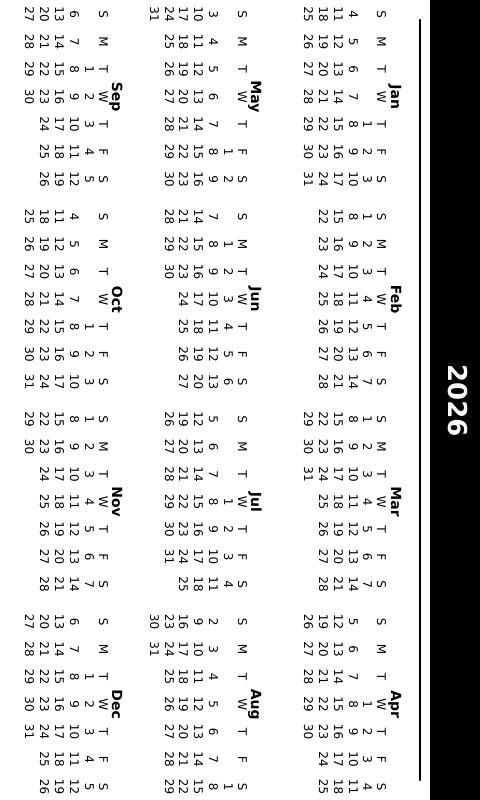
</p>

```bash
./deck calendar --year 2026 --output ./my-deck/calendar-2026.bmp
./deck calendar --year 2026 --portrait --output ./my-deck/calendar-2026-portrait.bmp
```

---

## Reference & Cheat Sheets

### Keyboard Shortcuts

Put the shortcuts you actually use on your desk. Vim, Git, Emacs, any tool.

<p align="center">
  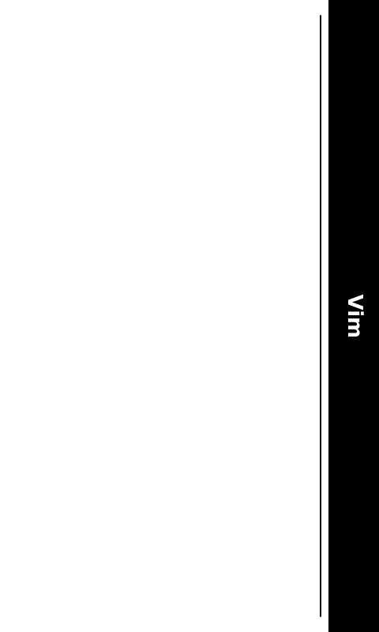
</p>

```bash
./deck cheatsheet --title "Vim" --shortcuts "i:insert,Esc:normal,:w:save,:q:quit,dd:delete,yy:yank,p:paste,u:undo" --output ./my-deck/vim.bmp
```

### NATO Phonetic Alphabet

Classic laminated reference. Never wonder how to spell "B" again.

<p align="center">
  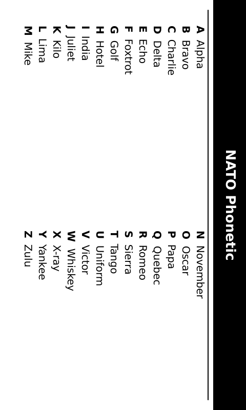
</p>

```bash
./deck nato --output ./my-deck/nato.bmp
```

---

## Safety & Health

### Emergency Contact Card

Always-accessible ICE info. Blood type and emergency numbers.

<p align="center">
  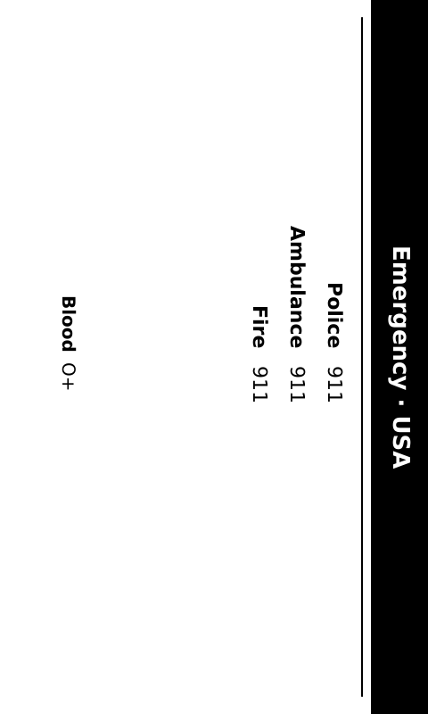
</p>

```bash
./deck emergency --country "USA" --contacts "Police:911,Ambulance:911,Fire:911" --blood "O+" --output ./my-deck/emergency.bmp
```

### Habit Tracker

Weekly grid for tracking routines. Replaces the paper version on your fridge.

<p align="center">
  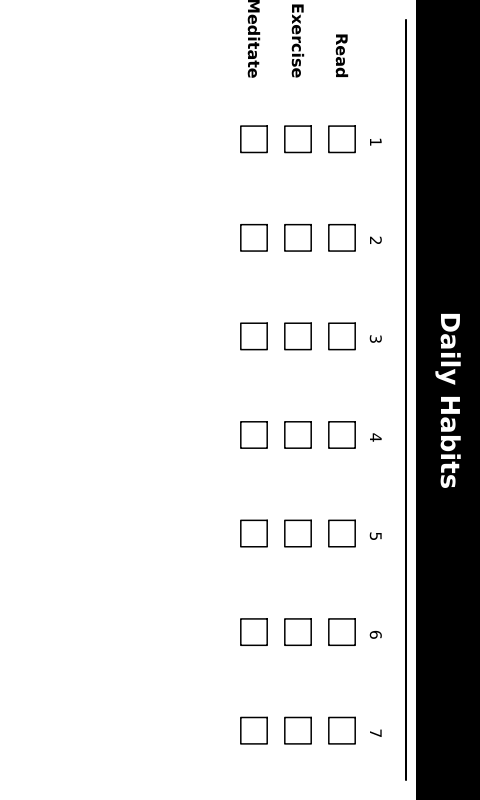
</p>

```bash
./deck habit --title "Daily Habits" --habits "Read,Exercise,Meditate,Journal" --days "7" --output ./my-deck/habit.bmp
```

---

## Travel & Checklists

### Packing Checklist

Reusable for every trip. Checkboxes you can mentally tick.

<p align="center">
  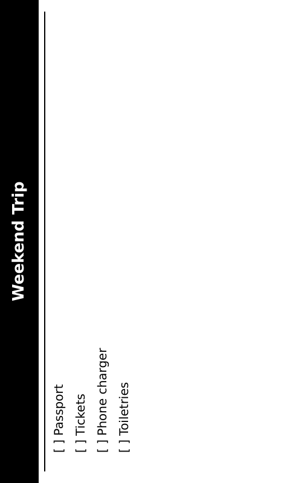
</p>

```bash
./deck packing --title "Weekend Trip" --items "Passport,Phone,Charger,Toothbrush,Clothes,Money,Keys,Camera,Snacks,Book" --output ./my-deck/packing.bmp
```

---

## Home & Kitchen

### Recipe Card

One recipe, big type. No scrolling with flour on your fingers.

<p align="center">
  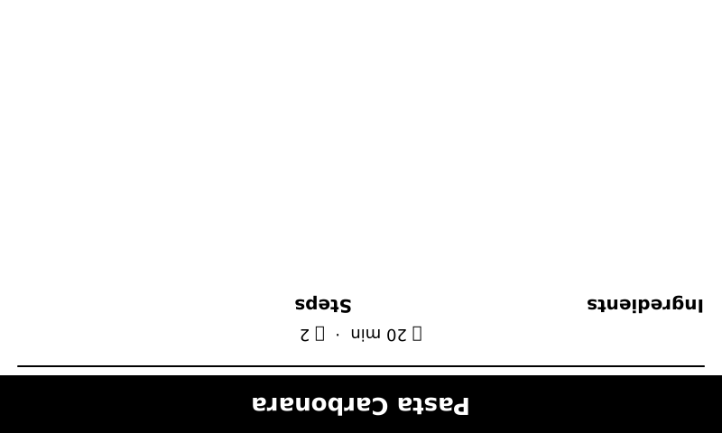
</p>

```bash
./deck recipe --title "Pasta Carbonara" --ingredients "Spaghetti,Eggs,Pancetta,Parmesan,Black pepper" --steps "Cook pasta,Fry pancetta,Mix eggs & cheese,Combine all,Serve hot" --time "20 min" --servings "2" --output ./my-deck/carbonara.bmp
```

### Plant Care Guide

Water, light, humidity, food schedule per plant. Replaces sticky notes in pots.

<p align="center">
  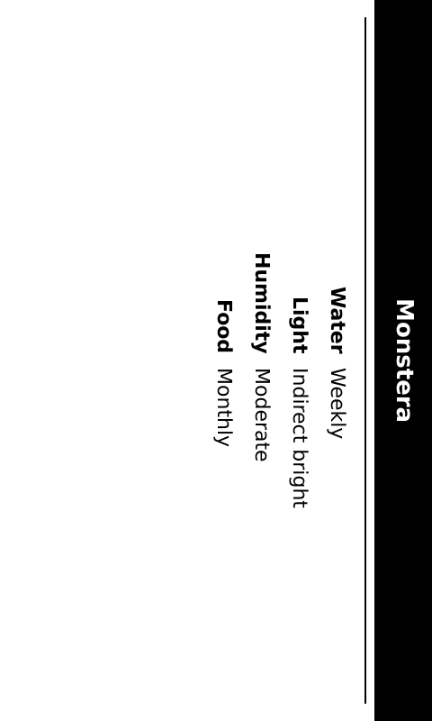
</p>

```bash
./deck plant --plant "Monstera Deliciosa" --water "Weekly" --light "Indirect bright" --humidity "Moderate" --food "Monthly" --output ./my-deck/monstera.bmp
```

---

## Fitness

### Bodyweight Workout

No-equipment circuit with rounds and rest intervals. Replaces the gym poster.

<p align="center">
  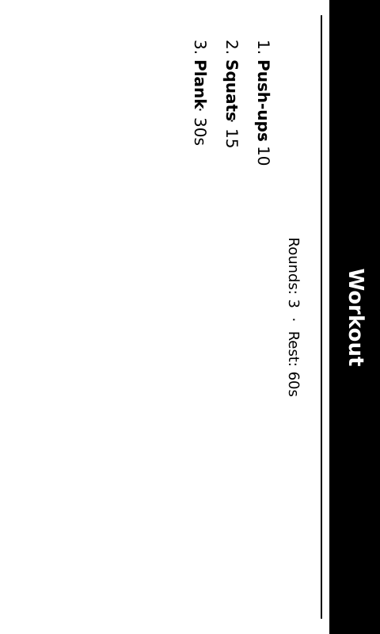
</p>

```bash
./deck workout --title "Morning Circuit" --exercises "Push-ups:10,Squats:15,Plank:30s,Lunges:12,Jumping Jacks:20" --rounds "3" --rest "60" --output ./my-deck/workout.bmp
```

---

## More Card Types

The gallery above shows the most popular cards. CrossPoint Deck supports 24 card types total. Run `./deck --help` to see them all.

Here are the remaining types with quick examples:

| Card | Example Command |
|---|---|
| `chore` | `./deck chore --title "Weekly Chores" --chores "Dishes,Laundry,Vacuum,Trash,Dust" --output ./my-deck/chores.bmp` |
| `coffee` | `./deck coffee --method "French Press" --ratio "1:15" --temp "94°C" --time "4 min" --output ./my-deck/coffee.bmp` |
| `convert` | `./deck convert --output ./my-deck/convert.bmp` |
| `library` | `./deck library --name "Alex" --card-number "29103000123456" --branch "Downtown" --output ./my-deck/library.bmp` |
| `loyalty` | `./deck loyalty --stores "Airline:FF123456,Gym:MEM789" --output ./my-deck/loyalty.bmp` |
| `maintenance` | `./deck maintenance --output ./my-deck/maintenance.bmp` |
| `meeting` | `./deck meeting --room "Boardroom" --output ./my-deck/meeting.bmp` |
| `morse` | `./deck morse --output ./my-deck/morse.bmp` |
| `periodic` | `./deck periodic --output ./my-deck/periodic.bmp` |
| `shopping` | `./deck shopping --output ./my-deck/shopping.bmp` |
| `stretch` | `./deck stretch --output ./my-deck/stretch.bmp` |
| `timezones` | `./deck timezones --local "New York EST" --cities "Tokyo:+14h,London:+5h" --output ./my-deck/timezones.bmp` |

All cards support `--portrait` for 480×800 output and `--font /path/to/font.ttf` for custom fonts.

---

*Want to add a new card type? See [CONTRIBUTING.md](CONTRIBUTING.md).*
