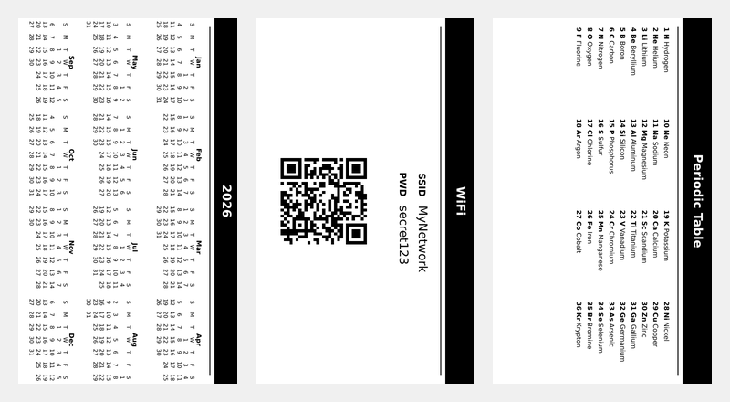

# 🗃️ CrossPoint Deck

[](https://go.dev/)
[](https://opensource.org/licenses/MIT)

> A CLI tool to turn your XTEink X4 e-reader into an offline, glanceable information hub. Generate static e-ink dashboards, calendars, and utility cards.

<p align="center">
  
</p>

Turn your XTEink X4 e-reader into a **glanceable information hub** — a deck of useful cards you reference in seconds, not minutes. Perfect for offline productivity, organization, and displaying quick-reference data on e-ink displays.

## What is this?

Your XTEink X4 is great for reading books. But it also excels at showing **static, high-contrast information** — things you glance at quickly: a calendar, a WiFi password with a QR code, a packing checklist, or a "this belongs to" card.

**CrossPoint Deck** generates these cards as `.bmp` images, perfectly sized for the X4's 800×480 display. You put them in a folder on your SD card, browse to it on the device, and flip through them like a deck of cards.

No firmware modifications. No mobile app. No complicated sync setup. Just generate, copy, and go.

## 🎨 What It Looks Like

CrossPoint Deck generates a variety of cards designed with high-contrast typography specifically for e-ink displays. 

> [!TIP]
> 🖼️ **[Click here to view the full image gallery in EXAMPLES.md](EXAMPLES.md)** to see all the cards you can generate!

**Some of the things you can create:**
* **Owner Cards:** *"If found, please contact"* — great for a device you carry around.
* **WiFi Access:** Guests scan the QR code instead of asking for the password.
* **Calendars:** Replaces a wall calendar. Always visible, never needs charging.
* **Periodic Table:** A quick science reference card.
* **Checklists:** Packing lists, habit trackers, and chore charts.

## Quick Start: From Zero to Card

### 1. Install

You need [Go](https://go.dev/dl/) installed (1.22 or newer).

```bash
git clone https://github.com/dubyte/crosspoint-deck.git
cd crosspoint-deck
go build ./cmd/deck
```

This creates a `deck` command in the current folder.

### 2. Generate a Card

```bash
# Owner card
./deck owner --name "Your Name" --email "you@example.com" --output ./output/owner.bmp

# WiFi card with QR code
./deck wifi --ssid "YourNetwork" --password "secret123" --output ./output/wifi.bmp

# 2026 calendar (landscape)
./deck calendar --year 2026 --output ./output/calendar-2026.bmp

# Portrait orientation works too
./deck owner --name "Your Name" --email "you@example.com" --portrait --output ./output/owner-portrait.bmp
```

Every card is an **uncompressed 24-bit BMP** at exactly 800×480 pixels (or 480×800 for portrait). The X4's display dithers these to 4 grayscale levels natively, so text looks crisp and anti-aliased edges stay smooth.

### 3. Copy to Your SD Card

Take the SD card out of your X4, plug it into your computer, and copy the folder:

```bash
# Linux / macOS
cp -r ./output /media/your-sd-card/Deck/

# Windows — drag and drop the folder to the SD card
```

Or use the existing [CrossPoint Sync](https://github.com/zabirauf/crosspoint-sync) app to upload wirelessly.

### 4. Browse on Your X4

1. Put the SD card back in the X4.
2. From the main menu, choose **Browse Files**.
3. Navigate to the `Deck/` folder.
4. Tap any `.bmp` file — it opens full-screen in the built-in image viewer.
5. Use the **Prev/Next buttons** (or volume buttons) to swipe through all cards in the folder.

That's it. Your e-reader is now a deck of useful reference cards.

## What Cards Can I Make?

Run `./deck --help` to see all commands, or `mage -l` for build tasks. For a full gallery with generated images and copy-paste commands, see **[EXAMPLES.md](EXAMPLES.md)**.

| Card | What it's for | Example use |
|---|---|---|
| `owner` | "This belongs to" identification | Leave on your device in case you lose it |
| `wifi` | WiFi password + QR code | Guests scan instead of asking |
| `business` | Contact card with QR vCard | Share info instantly at meetups |
| `calendar` | Year-at-a-glance | Wall calendar replacement |
| `cheatsheet` | Keyboard shortcuts | Vim, Git, or any tool you use daily |
| `emergency` | Emergency contacts | Always-accessible ICE info |
| `habit` | Habit tracker grid | Track daily routines |
| `packing` | Packing checklist | Reuse for every trip |
| `recipe` | Recipe with ingredients & steps | Cooking without touching your phone |
| `plant` | Plant care guide | Water/light schedule per plant |
| `workout` | Bodyweight workout | Gym card replacement |
| `coffee` | Brew guide with ratios | Pour-over or French press steps |
| `nato` | Phonetic alphabet | Classic reference card |
| `periodic` | Periodic table | Science reference |
| `timezones` | World time zones | Quick reference for calls |
| ...and 9 more | See `./deck --help` | |

## Using Mage (Optional)

If you have [Mage](https://magefile.org/) installed, there are pre-made tasks:

```bash
mage -l              # List all tasks
mage calendar        # Generate 2026 calendar
mage wifi            # Generate example WiFi card
mage owner           # Generate example owner card
mage all             # Generate every card type
mage verify          # Run tests and check outputs
mage clean           # Remove generated files
```

## Tips for Great Cards

- **High contrast works best.** Black text on white, or white text on black bars. The X4's display is monochrome — if a design needs color to work, it won't survive e-ink.
- **Portrait vs. landscape.** The default is landscape (800×480). Use `--portrait` for 480×800 if you prefer holding the device vertically. The viewer auto-rotates if needed.
- **Folder = deck.** Put multiple `.bmp` files in one SD card folder and you can flip through them with Prev/Next. Create separate folders for different purposes: `/Deck/Work/`, `/Deck/Travel/`, `/Deck/Home/`.
- **No need to overthink fonts.** The tool tries common system fonts automatically (DejaVu, Liberation, Noto, Helvetica, Arial). If you want a specific font, use `--font /path/to/font.ttf`.
- **BMP only.** The X4 firmware only views `.bmp` files. PNG and JPG won't open in the image viewer.

## Technical Details (For the Curious)

- **Output format:** Uncompressed 24-bit BMP, 800×480 or 480×800 pixels
- **Grayscale:** The X4's SSD1677 controller dithers 24-bit color to 4 levels (white, light gray, dark gray, black). We preserve anti-aliased edges in the file and let the hardware handle the rest.
- **No compression:** Each card is ~1.15 MB. SD cards have plenty of space; the X4 has minimal RAM, so uncompressed BMPs stream directly from storage without decompression overhead.
- **Built with:** Go + [fogleman/gg](https://github.com/fogleman/gg) for 2D rendering

## Contributing

This project is MIT-licensed. If you have an idea for a new card type, adding one takes about 30 minutes of Go code:

1. Create a package in `pkg/templates/<name>/`
2. Implement `Render()` and `Spec()`
3. Add one line to the registry in `cmd/deck/main.go`

See **[CONTRIBUTING.md](CONTRIBUTING.md)** for a step-by-step guide, or [agents.md](agents.md) for the full developer guide.

## License

MIT — use, modify, distribute, and build on this freely. See [LICENSE](LICENSE) for the full text.

---

*CrossPoint Deck is an independent content generator for the CrossPoint Reader ecosystem. It is not affiliated with the firmware or sync app maintainers.*
